# Unit 21 Homework: Token CrowdSale 

This is my homework submission for week 21 of the fintech bootcamp. In this exercise, we deploy a smart contract to emulate the crowdsale event of a new token (KaiseiCoin). A combination of Remix, Ganache and Metamask is used for this exercise.

## Compile KaiseiCoin Contract
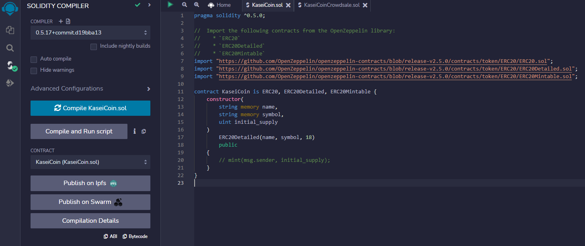

## Compile KaiseiCoinCrowdsale Contract
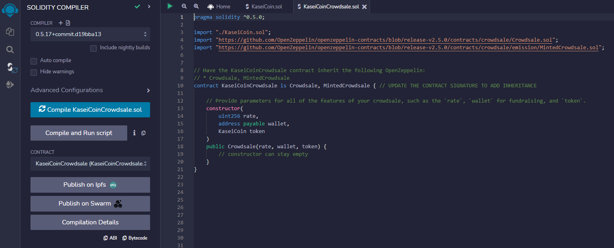

## Compile KaiseiCoinCrowdsaleDeployer Contract
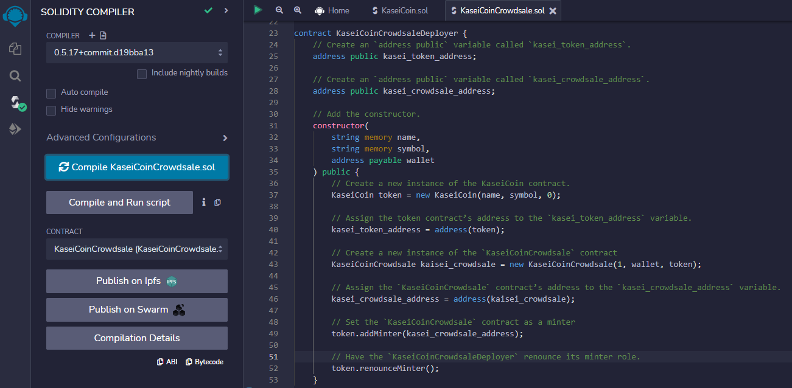

## Deploy KaiseiCoinCrowdsaleDeployer Contract
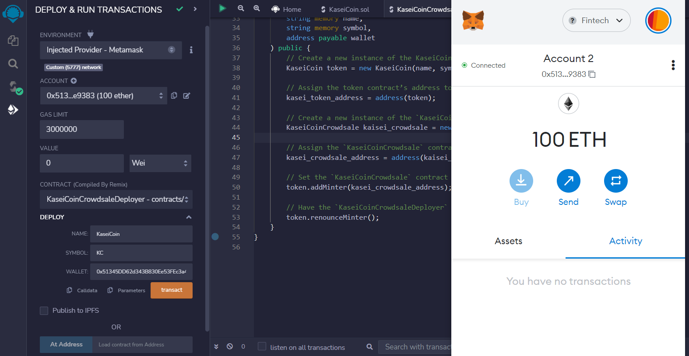

## Load Deployed KaiseiCoin Contract
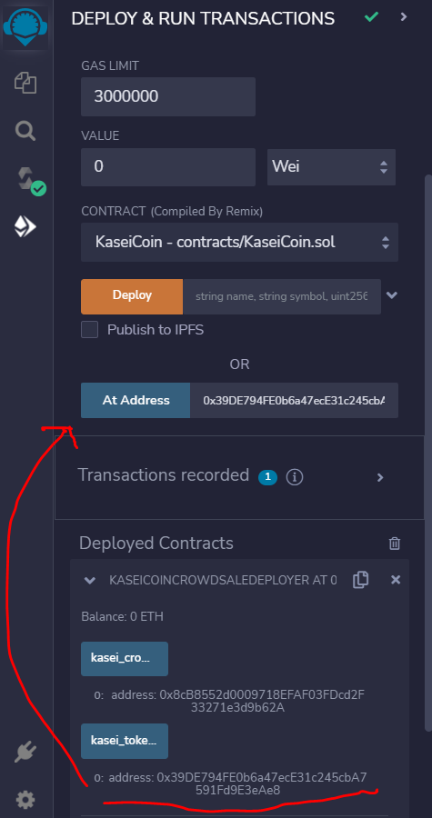

## Load Deployed KaiseiCoinCrowdsale Contract
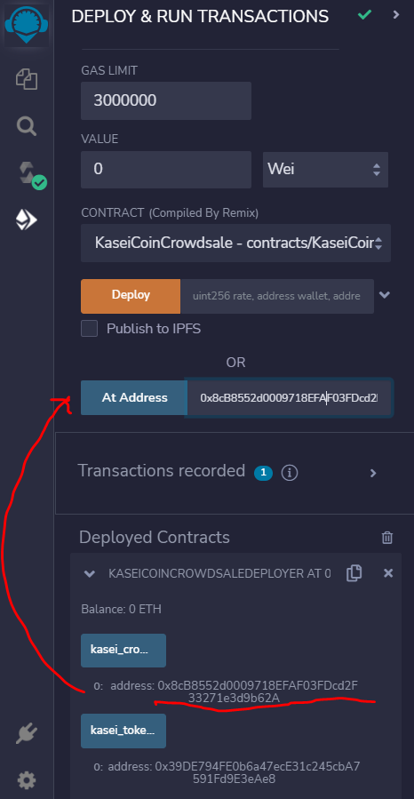

## Purchase 1: Account buy for itself
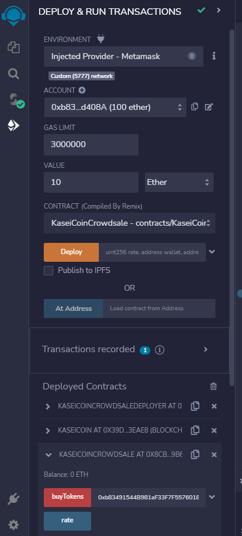

## After Purchase 1: Account balance, Total Supply, Wei Raised
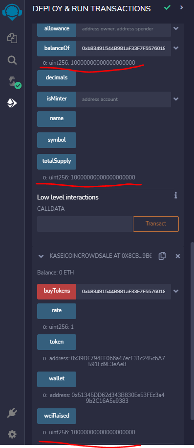

## Purchase 2: Account buy for another account
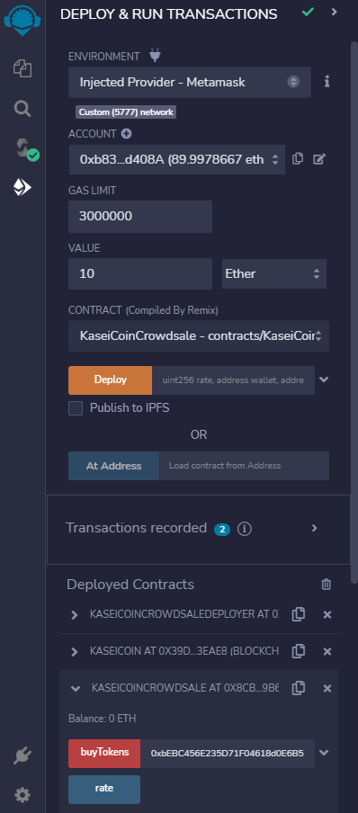

## After Purchase 2: Account balance, Total Supply, Wei Raised
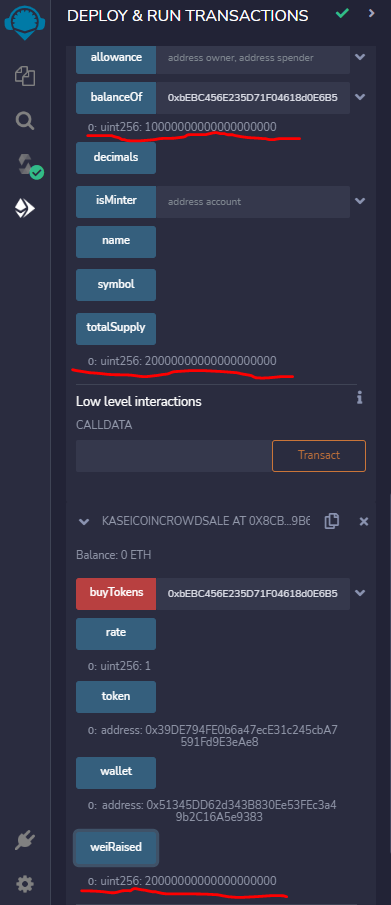

## MetaMask Balances: Buyer and Crowdsale issuer
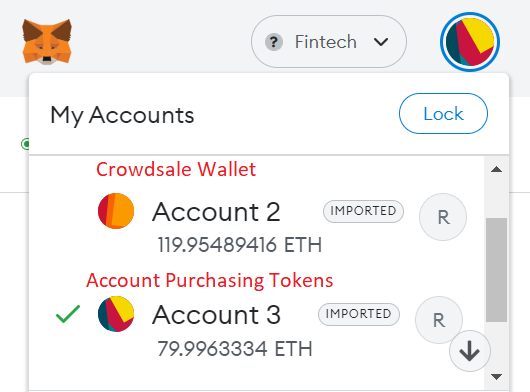
